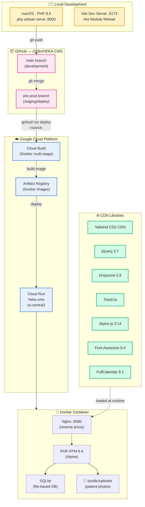
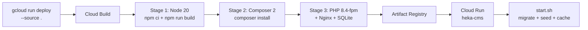
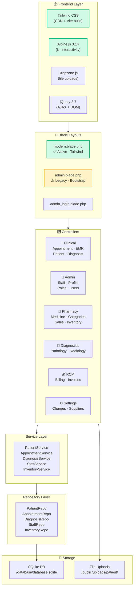

# HEKA Clinic Management System — Architecture & Infrastructure

> **Last Updated:** 27 Feb 2026 · **Repository:** [github.com/Oz6ix/HEKA-CMS](https://github.com/Oz6ix/HEKA-CMS) · **Live:** [heka-cms-1024385989093.us-central1.run.app](https://heka-cms-1024385989093.us-central1.run.app)

---

## Infrastructure Overview



---

## Git Branching Strategy

```mermaid
gitgraph
    commit id: "initial setup"
    branch pre-prod
    checkout main
    commit id: "sidebar fixes"
    commit id: "dashboard cards"
    commit id: "Alpine.js CDN fix"
    commit id: "demo data seeder"
    commit id: "profile redesign"
    checkout pre-prod
    merge main id: "merge to pre-prod"
    checkout main
    commit id: "EMR header fix"
    commit id: "photo upload fix"
    commit id: "appointment list fix"
    checkout pre-prod
    merge main id: "deploy v2"
```

| Branch | Purpose | Deploys To |
|--------|---------|-----------|
| **`main`** | Active development — all feature work and bug fixes land here first | Local dev |
| **`pre-prod`** | Staging/deploy branch — merged from `main` when ready to deploy | Cloud Run |

### Workflow
1. Develop and commit on **`main`**
2. `git checkout pre-prod && git merge main && git push origin pre-prod`
3. `gcloud run deploy heka-cms --source . --project=heka-cms --region=asia-southeast1 --allow-unauthenticated`

---

## Cloud Run Deployment Pipeline



### Docker Build (3-stage)
| Stage | Base Image | Action |
|-------|-----------|--------|
| **1. Frontend** | `node:20-alpine` | `npm ci` → `npm run build` (Vite/Tailwind) |
| **2. Composer** | `composer:2` | `composer install --no-dev --optimize` |
| **3. Production** | `php:8.4-fpm-alpine` | Nginx + PHP-FPM + SQLite, port 8080 |

### Container Startup (`start.sh`)
1. Generate `.env` from environment variables
2. `php artisan key:generate`
3. `php artisan migrate --force`
4. `php artisan db:seed --force` (idempotent — uses `firstOrCreate`)
5. `php artisan config:cache && route:cache && view:cache`
6. Start PHP-FPM (background) → Nginx (foreground, port 8080)

### Cloud Run Configuration
| Setting | Value |
|---------|-------|
| **Service Name** | `heka-cms` |
| **Project** | `heka-cms` |
| **Region** | `us-central1` |
| **Port** | `8080` |
| **Auth** | Unauthenticated (public) |
| **Tier** | Free tier |

---

## Application Architecture



---

## Module Breakdown

| Module | Controllers | Models | Key Features |
|--------|-----------|--------|-------------|
| **Clinical** | 5 | 12 | Appointments, EMR Workbench, Prescriptions, Documents, Referrals, Certificates |
| **Administration** | 6 | 7 | Staff, Departments, Roles, User Groups, Profile/Password |
| **Hospital Setup** | 7 | 6 | Charges, TPA, Casualty, Symptoms, Centers, Frequencies |
| **Pharmacy** | 8 | 12 | Medicines, Categories, Generics, Dosages, Sales, Inventory |
| **Diagnostics** | 4 | 8 | Pathology, Radiology Tests & Categories |
| **Billing & RCM** | 2 | 5 | Patient Bills, Revenue Cycle, Invoice Items |
| **Settings** | 4 | 5 | General, Suppliers, Units, Quantities |

---

## Tech Stack

| Layer | Technology |
|-------|-----------|
| **Backend** | Laravel 11, PHP 8.4 (Cloud Run) / 8.5 (Local) |
| **Database** | SQLite (file-based, in-container) |
| **Frontend** | Blade Templates, Tailwind CSS (CDN + Vite), Alpine.js 3.14 |
| **Libraries** | jQuery 3.7, Dropzone 5.9, Toastr, FullCalendar 6.1, Font Awesome 6.4 |
| **Build** | Vite 7.x, Docker 3-stage build |
| **Hosting** | Google Cloud Run (free tier, us-central1) |
| **CI/CD** | Manual: `gcloud run deploy --source .` via Cloud Build |
| **Repository** | [github.com/Oz6ix/HEKA-CMS](https://github.com/Oz6ix/HEKA-CMS) |
| **Live URL** | [heka-cms-1024385989093.us-central1.run.app](https://heka-cms-1024385989093.us-central1.run.app) |
| **Architecture** | MVC + Service + Repository Pattern |

---

## Key Files Reference

| File | Purpose |
|------|---------|
| `Dockerfile` | 3-stage Docker build (Node → Composer → PHP-FPM) |
| `docker/start.sh` | Container startup: migrate, seed, cache, start services |
| `docker/nginx.conf` | Nginx reverse proxy config, port 8080 |
| `docker/php.ini` | PHP production config overrides |
| `resources/views/backend/layouts/modern.blade.php` | Primary layout (Tailwind + Alpine + jQuery + Dropzone + Toastr) |
| `database/seeders/DemoDataSeeder.php` | Idempotent demo data (10+ records per module) |
| `database/seeders/DatabaseSeeder.php` | Admin user + demo data seeder (auto-runs on deploy) |
| `config/filesystems.php` | `uploads` disk → `public/uploads/` |

---

## Recent Changes Log

| Date | Change | Files Modified |
|------|--------|---------------|
| 27 Feb | Fix: blank appointment list (Alpine.js race condition → `Alpine.data()`) | `appointment/index.blade.php`, `modern.blade.php` |
| 26 Feb | Fix: patient photo upload 500 error + display in patient list & EMR | `PatientController.php`, `patient/index.blade.php`, `emr/show.blade.php` |
| 26 Feb | Fix: patient update button (hardcoded `/am/` → `$url_prefix`, JSON response) | `patient/edit.blade.php`, `PatientController.php` |
| 26 Feb | Fix: stray "Modal Title / Close" text + add jQuery/Dropzone/Toastr CDNs | `admin_modal_popup_alert.blade.php`, `modern.blade.php` |
| 26 Feb | Fix: EMR workbench dimmed patient name (inline styles for dark header) | `emr/show.blade.php` |
| 26 Feb | Feat: admin profile & password change page redesign | `profile/edit.blade.php` |
| 25 Feb | Fix: DemoDataSeeder column mismatches, DatabaseSeeder idempotency | `DemoDataSeeder.php`, `DatabaseSeeder.php` |
| 24 Feb | Feat: appointment calendar, patient EMR link, dashboard improvements | Multiple files |
